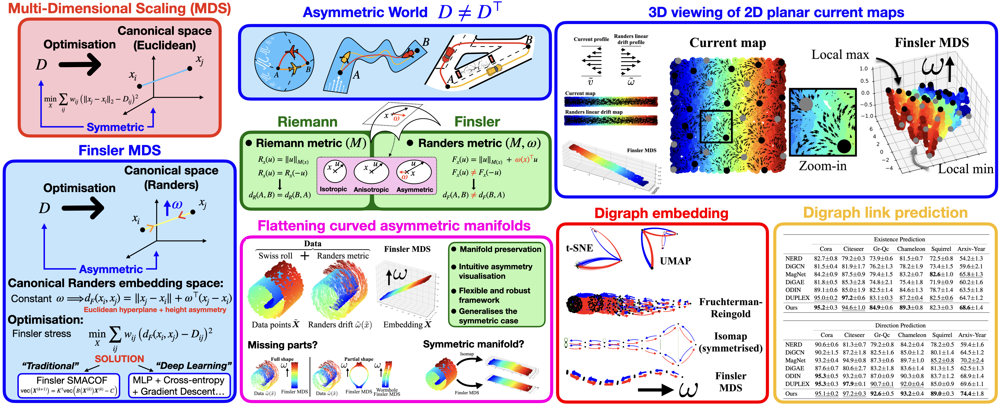

# Finsler Multi-Dimensional Scaling: Manifold Learning for Asymmetric Dimensionality Reduction and Embedding [\[Paper CVPR 2025\]](https://arxiv.org/abs/2503.18010)

---

## Abstract

Dimensionality reduction is a fundamental task that aims to simplify complex data by reducing its feature dimension- ality while preserving essential patterns, with core applica- tions in data analysis and visualisation. To preserve the un- derlying data structure, multi-dimensional scaling (MDS) methods focus on preserving pairwise dissimilarities, such as distances. They optimise the embedding to have pair- wise distances as close as possible to the data dissimilar- ities. However, the current standard is limited to embed- ding data in Riemannian manifolds. Motivated by the lack of asymmetry in the Riemannian metric of the embedding space, this paper extends the MDS problem to a natural asymmetric generalisation of Riemannian manifolds called Finsler manifolds. Inspired by Euclidean space, we define a canonical Finsler space for embedding asymmetric data. Due to its simplicity with respect to geodesics, data repre- sentation in this space is both intuitive and simple to anal- yse. We demonstrate that our generalisation benefits from the same theoretical convergence guarantees. We reveal the effectiveness of our Finsler embedding across various types of non-symmetric data, highlighting its value in applica- tions such as data visualisation, dimensionality reduction, directed graph embedding, and link prediction.

---

## Installation

This project does not require any special dependencies or installations. Dependencies can be installed with the usual package installers, e.g. `pip` or `conda`: `pip install [package-name]`.


1. Mandatory basic packages: `numpy`, `scikit-learn`, `scipy`

2. Optional packages for some experiments: `umap`, `networkx`

---

## Quick usage

To compute the Finsler Multi-Dimensional Scaling embedding on a (asymetric) square data matrix `D` using the Finsler SMACOF algorithm, simply compute

```
embedding, _ = _mds_finsler.smacof(
            D, 
            randers_w_alpha=alpha, 
            metric=True,
            n_components=proj_dim,
        )
```

where `alpha` is the magnitude $\alpha$ of the Randers drift component of the `proj_dim`-dimensional canonical Randers space for the embedding: $\omega = (0,\ldots, 0,\alpha)^\top$. Other options are available (initialisation, stopping criteria, non-uniform weights...).

---

## Demos

Run the following scripts to replicate the visual results from the paper:

- `main_swiss_roll_full`: Figs 2, 6, 7

- `main_swiss_roll_hole`: Fig 3

- `main_2D_maps`: Fig 8 (river), Fig 4 (sea)

- `main_graph`: Fig 5

---

## Note on (worm)holes

The Finsler wormhole code is built on top of the code for the original symmetric wormhole criterion, from the paper *Bracha et al. Wormhole Loss for Partial Shape Matching, NeurIPS 2024* [[paper]](https://proceedings.neurips.cc/paper_files/paper/2024/hash/ed24eafde44aef581b9f605319583b6d-Abstract-Conference.html)[[code]](https://github.com/ABracha/Wormhole/tree/main). Our code is also an official implementation for this work by taking `alpha = 0` for the embedding's canonical Randers space.

If you are using the vanilla or Finsler wormhole embedding method, or using our implementation for the weighted SMACOF algorithm (which is not implemented in scikit-learn), please also cite the original wormhole paper.

```bibtex
@article{bracha2025wormhole,
  title={Wormhole Loss for Partial Shape Matching},
  author={Bracha, Amit and Dag{\`e}s, Thomas and Kimmel, Ron},
  journal={Advances in Neural Information Processing Systems},
  volume={37},
  pages={131247--131277},
  year={2025}
}
```


## Acknowledgement

Our implementation of the Finsler SMACOF algorithm is an adaptation of the SMACOF algorithm implementation in scikit-learn [[sklearn:_mds.py]](https://github.com/scikit-learn/scikit-learn/blob/da08f3d99/sklearn/manifold/_mds.py#L193).


---
## License

This project is licensed under the MIT License. See the `LICENSE` file for details.

---

## Citation

If you find our work useful in your research, please cite:

```bibtex
@inproceedings{dages2025finsler,
  title={Finsler Multi-Dimensional Scaling: Manifold Learning for Asymmetric Dimensionality Reduction and Embedding},
  author={Dag{\`e}s, Thomas and Weber, Simon and Lin, Ya-Wei Eileen and Talmon, Ronen and Cremers, Daniel and Lindenbaum, Michael and Bruckstein, Alfred M and Kimmel, Ron},
  booktitle={Proceedings of the Computer Vision and Pattern Recognition Conference},
  pages={25842--25853},
  year={2025}
}
```